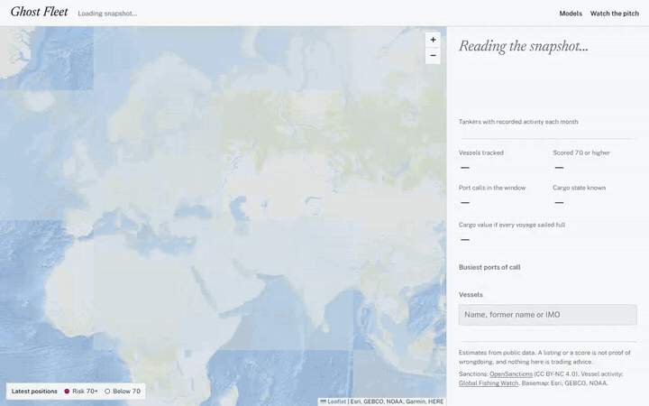
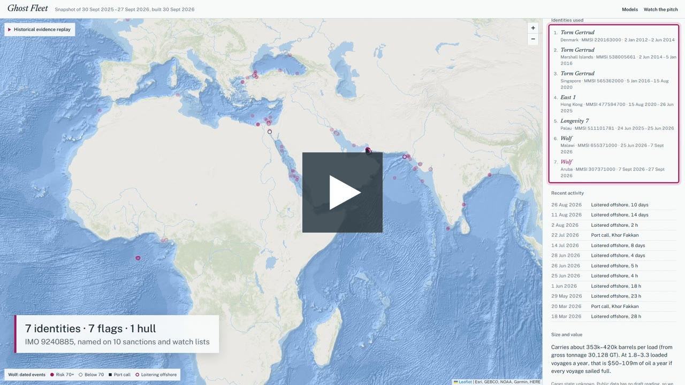
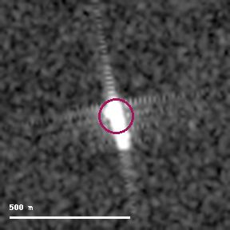
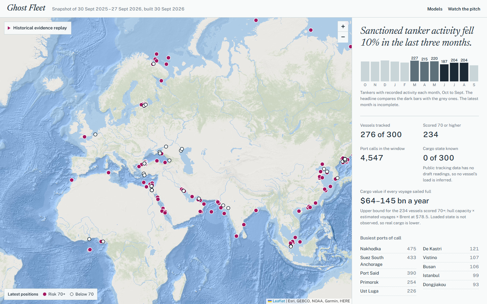
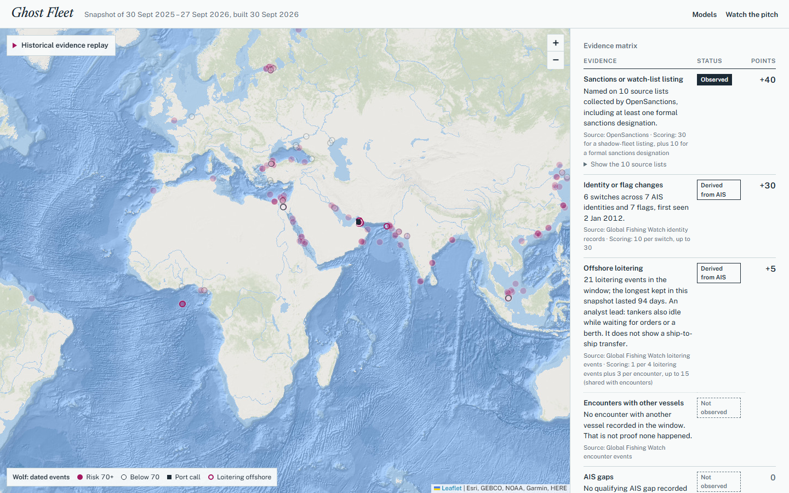
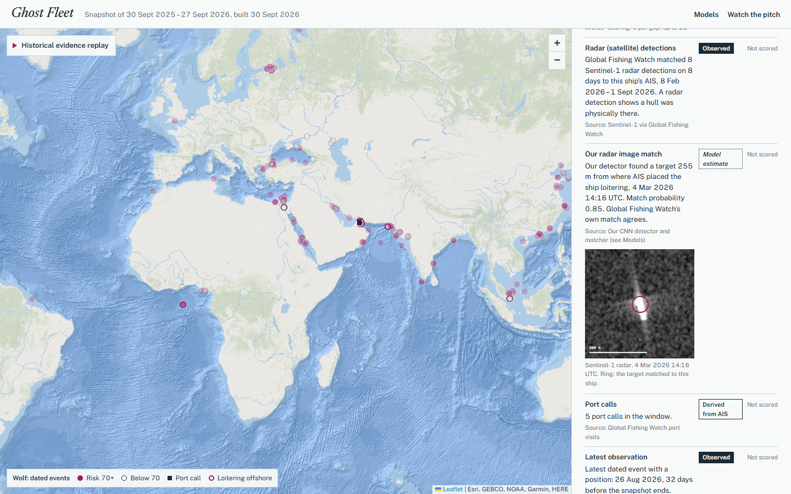
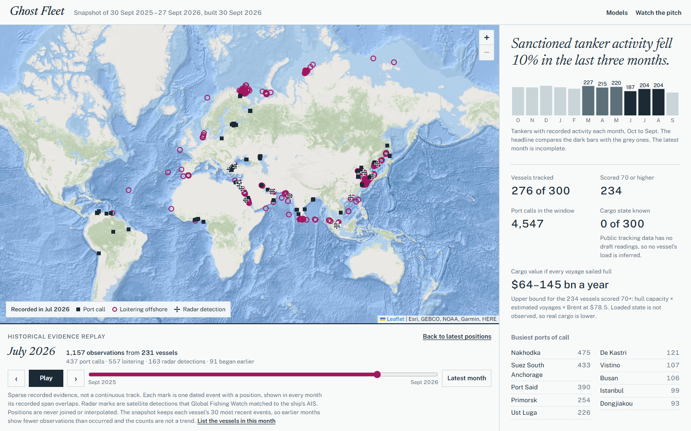
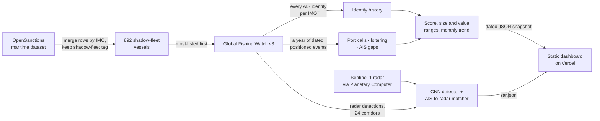

<div align="center">

# Ghost Fleet

**Hidden oil supply, seen from the sea.**
A map-first monitor of the sanctioned shadow-fleet tankers, built for oil traders from public data.

[](https://ghost-fleet.vercel.app)


[](LICENSE)



**[Try it live](https://ghost-fleet.vercel.app)** · **[Watch the 4-minute pitch](https://ghost-fleet.vercel.app/watch.html)** · **[Open WOLF's dossier](https://ghost-fleet.vercel.app/#imo=9240885)** · **[See the models](https://ghost-fleet.vercel.app/models.html)**

</div>

---

> A ship can turn off its beacon, but it cannot stop leaving a trail.

Since 2022, a shadow fleet of ageing tankers has kept sanctioned Russian oil
moving by changing names, flags and radio identities. Ghost Fleet answers the
oil trader's question: **is that hidden supply rising or falling, and where is
it moving?**

## Watch the 4-minute pitch

<a href="https://ghost-fleet.vercel.app/watch.html"></a>

A narrated walkthrough of the live product: the trend, the routes, one ship's
seven identities, the evidence matrix, satellite radar, the evidence replay
and what the data can't tell us. It runs 4 min 8 s at 1080p,
with English subtitles and 13 chapters. The narration is voiced with
ElevenLabs, and every on-screen number comes from the same snapshot. You can
also [download the MP4](https://ghost-fleet.vercel.app/media/ghost-fleet-demo.mp4)
or read the [subtitles](dashboard/media/ghost-fleet-demo.srt).

## What the snapshot shows

| | 30 Sep 2025 – 27 Sep 2026 |
|---|---|
| Shadow-fleet tankers screened | **300**, all matched to tracking data; 276 with a recent position |
| Active tankers, last 3 months vs the 3 before | **−10%** (595 vs 662 vessel-months) |
| Switched identity at least once | **289** (124 switched five or more times) |
| Different flags used | **81** |
| Flagged today to a landlocked country | **11**: Malawi 4, Mali 3, Zimbabwe 3, Botswana 1 |
| Now flagged to Russia | **115** |
| Busiest ports of call | Nakhodka, Suez, Port Said, Primorsk, Ust-Luga |
| Seen by satellite radar | **255** tankers with Sentinel-1 detections matched to their AIS (24 corridors) |

## One hull, seven identities

IMO 9240885 is named on 10 sanctions and watch lists.
[Open its dossier →](https://ghost-fleet.vercel.app/#imo=9240885)

| # | Name | Flag | Years |
|---|---|---|---|
| 1 | Torm Gertrud | Denmark | 2012–14 |
| 2 | Torm Gertrud | Marshall Islands | 2014–16 |
| 3 | Torm Gertrud | Singapore | 2016–20 |
| 4 | East 1 | Hong Kong | 2020–25 |
| 5 | Longevity 7 | Palau | 2025–26 |
| 6 | Wolf | Malawi (landlocked) | Jun–Sep 2026 |
| 7 | **Wolf** | **Aruba** | since 7 Sep 2026 |

Its score of 75 is fully explained in its evidence matrix: 40 for the
listings, 30 for identity switches and 5 for loitering at sea. This summer it
idled offshore for up to 14 days at a time. Satellite radar picked it up 8
times, and our detector finds it in the 4 March 2026 image 255 m from where
its AIS placed it.

<p align="center">
  
</p>

## Features

- **Chart-style map.** Every located tanker at its latest observed position,
  with high-risk vessels in the magenta that nautical charts use for hazards.
- **Trend headline.** One plain sentence over 12 months of bars, showing
  exactly which months are compared.
- **Busiest ports.** The export routes appear straight out of the data.
- **Vessel dossier with an evidence matrix.** Each piece of evidence
  (listing, identity switches, loitering, encounters, AIS gaps, port calls,
  latest observation, cargo state) is marked *Observed*, *Derived from AIS*,
  *Not observed* or *Unavailable / unknown*, next to the points it adds to
  the score. Also: every identity in order, recent dated activity on the map,
  size and value ranges, and source links to OpenSanctions and Global Fishing
  Watch.
- **Seen by satellite radar.** Global Fishing Watch's Sentinel-1 detections
  matched to each tanker, and our own detector's image of the tanker where
  AIS placed it, with the match probability.
- **Historical evidence replay.** Step or play month by month through the
  dated, positioned events in the snapshot. Each mark is one recorded event,
  never a route or an interpolated position. The counts are not a trend,
  because the snapshot keeps each vessel's 30 most recent events.
- **Search by former name.** Type a name a ship used years ago and find what
  it is called today.
- **Models, honestly reported.** A [Models page](https://ghost-fleet.vercel.app/models.html)
  shows what each model was measured against, including the one that failed.
- **Honest unknowns.** No draft data means cargo state is "unknown", not a
  guess. Values are ranges with their assumptions shown.
- **Narrated pitch video.** A reproducible 1080p walkthrough with subtitles
  and chapters, built from the live site by code in `video/`.

<p align="center">
  
  
  
  
</p>

## How it works



1. **Who is in the fleet.** The OpenSanctions export has one row per source
   list. Merging by IMO gives 892 shadow-fleet vessels, 772 of them formally
   sanctioned.
2. **What they did.** Global Fishing Watch often stores each re-flag as a
   separate record. We collect every identity carrying the IMO, then a year
   of port calls, loitering and AIS gaps across all of them.
3. **What it means.** An additive score, capacity ranges from gross
   tonnage, and a monthly activity series, written to a dated snapshot the
   dashboard reads.
4. **What radar shows** (`ml/`). GFW's Sentinel-1 detections for the 24
   corridors where these tankers spend the most time, radar chips read
   remotely, a small CNN detector, a matcher that finds each tanker in the
   image from its AIS position, a reviewed side-by-side queue and a
   pre-registered cargo-state test.

## The models, and what they were measured against

| Model | Result | Measured against |
|---|---|---|
| CNN vessel detector | PR-AUC **0.991**, 97% recall at 98% precision, on 147 unseen radar scenes (CFAR baseline: 0.964) | GFW's radar detections: agreement, not ground truth |
| Tanker-to-radar matcher | Top target agrees with GFW's own match **87%** of the time (583 images) | GFW's AIS match, which our matcher never sees |
| Possible side-by-side pairs | **5** confirmed of 90 reviewed candidates; the automatic rule alone is unreliable at 10 m pixels | Visual review by Claude, not an expert analyst |
| Loaded or empty from radar | AUC **0.47** on unseen tankers, a coin toss. **Failed** the pass mark set in advance, so cargo stays unknown | Voyage-context labels (weak) |

Every figure is on the [Models page](https://ghost-fleet.vercel.app/models.html),
rendered from `dashboard/data/sar.json`.

## What we show, and what we don't claim

| We show | We don't claim |
|---|---|
| Which listed ships are active, and where | That any ship broke the law |
| Identity switches, from tracking records | Whether a tanker is loaded: free data has no draft |
| Value as an upper bound ($64–145 bn a year) | Barrels actually moved |
| Long idle periods at sea | That a ship-to-ship transfer happened |
| Radar sightings and model matches, with scores | Accuracy against ground truth: we report agreement with GFW |
| A dated one-year snapshot of 300 of 892 ships | A live feed |

## Run it yourself

Requirements: Python 3.10+, a free
[Global Fishing Watch API token](https://globalfishingwatch.org/our-apis/tokens),
and the [OpenSanctions maritime export](https://www.opensanctions.org/datasets/maritime/)
saved as `maritime.csv` in the repo root.

```powershell
python -m venv .venv; .\.venv\Scripts\Activate.ps1
python -m pip install -r requirements.txt
$env:GFW_API_TOKEN = "your-token"

python dark_fleet_pipeline.py --max 300 --start 2025-09-30 --end 2026-09-27
python dark_fleet_pipeline.py --max 300 --offline      # rebuild from the response cache
python -m pytest -q                                    # offline tests
python scripts/figures.py                              # every figure quoted in the docs

cd dashboard; python -m http.server 8765               # http://localhost:8765
vercel deploy --prod --cwd dashboard                   # deploy (static, no build)
python scripts/record_demo.py                          # re-record docs/demo.gif
python scripts/screenshots.py                          # re-capture the README screenshots

# Radar + ML (needs requirements-ml.txt, PyTorch; GPU optional)
python -m pip install -r requirements-ml.txt
python -m ml.gfw_sar          # GFW radar detections for 24 corridors (one report at a time)
python -m ml.dataset          # Sentinel-1 chips, read remotely from Planetary Computer
python -m ml.detector train; python -m ml.detector eval
python -m ml.matching; python -m ml.sts queue; python -m ml.cargo
python -m ml.build            # writes dashboard/data/sar.json and radar thumbnails
python tests/browser_check.py # 157 browser checks against a local server

# The pitch video (needs ELEVENLABS_API_KEY, Playwright, ffmpeg)
python video/make_voice.py      # narration per scene; cached, only changed scenes cost characters
python video/record_scenes.py   # 1080p scene capture of the live site, synced to the narration
python video/assemble.py        # crossfades + audio + subtitles -> dashboard/media/
```

The pipeline writes `dashboard/data/vessels.json` and `signal.json`. These
are committed deliberately, so the hosted demo needs no token. Raw API
responses are cached in `.cache/gfw/` (git-ignored).
`dashboard/data/vessels.demo.json` holds **fictional** vessels for offline
use and is never deployed.

## Project docs

- [Product brief](docs/PRODUCT_BRIEF.md): who it is for and the one question
  it answers.
- [Concept overview](docs/CONCEPT_OVERVIEW.md): the problem from first
  principles.
- [Models page](https://ghost-fleet.vercel.app/models.html): every model
  result and its reference, live.
- [SAR + ML feasibility](docs/SAR_ML_FEASIBILITY.md): what radar can support
  now, what remains experimental, and the evidence behind that distinction.
- [SAR + ML pilot plan](docs/SAR_ML_PILOT_PLAN.md): gated research stages for
  dark-vessel, STS-candidate, and cargo-state experiments.
- [Verified data sources](docs/DATASETS_AND_ML_RESEARCH.md): access, licensing,
  labels, resolution, and ground-truth constraints.
- Submission: [write-up](docs/submission/WRITEUP.md),
  [demo script](docs/submission/DEMO_SCRIPT.md),
  [pitch outline](docs/submission/PITCH.md).
- [Handover](docs/HANDOVER.md), [changelog](CHANGELOG.md),
  [session log](docs/SESSION_LOG.md), [collaboration rules](AGENTS.md).

## Data and licence

The code is released under the [MIT licence](LICENSE). The data keeps its
sources' terms:

- **OpenSanctions:** CC BY-NC 4.0; businesses need a data licence.
- **Global Fishing Watch:** non-commercial use, with attribution. Includes
  its Sentinel-1 radar detections.
- **Sentinel-1:** contains modified Copernicus Sentinel data, via Microsoft
  Planetary Computer.
- **Basemap:** Esri, GEBCO, NOAA.

A commercial version would use licensed AIS data (with draft readings, to
tell loaded from empty) and a commercial sanctions-data licence.

A sanctions listing or a score is not proof of wrongdoing, and nothing here
is trading advice.
