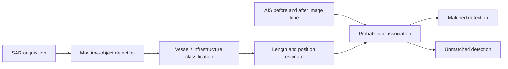
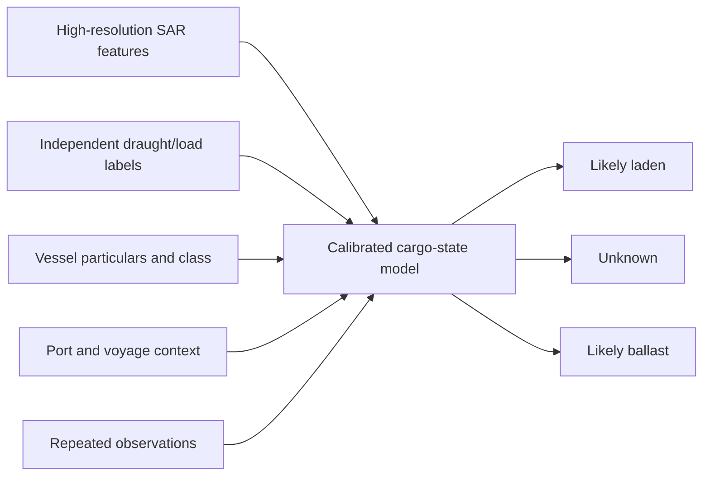

# SAR + ML Feasibility for Ghost Fleet

*Research review: 2026-09-30 · Status: post-hackathon R&D, not a current product
capability*

## Executive answer

Yes, SAR and machine learning can add real value to Ghost Fleet, but not all of
the proposed capabilities are equally mature.

| Proposed capability | Feasibility now | Evidence-based conclusion |
|---|---|---|
| Detect a large vessel independently of AIS | **High** | Demonstrated at scale with Sentinel-1 and xView3/GFW. This is the best first capability. |
| Flag an SAR detection that has no plausible AIS match | **High for a research lead** | GFW already exposes matched/unmatched SAR detections. “Unmatched” has innocent and technical explanations and is not proof of AIS disabling. |
| Detect two large vessels side-by-side | **Medium** | Demonstrated with high-resolution satellite imagery and recent SAR/AIS research. Free Sentinel-1 can be ambiguous when adjacent hulls merge; commercial SAR is better suited. |
| Confirm that cargo transferred | **Low from one image** | Geometry can identify an STS candidate, not hoses, cargo flow, legality, or cargo origin. Multiple observations and contextual evidence are required. |
| Estimate vessel length/orientation | **Medium to high** | An explicit xView3 task, with known errors from motion, resolution, and imaging geometry. |
| Measure tanker freeboard and classify laden/ballast from routine Sentinel-1 | **Low / research only** | The physics is plausible and narrow PolSAR/high-resolution studies exist, but routine Sentinel-1 resolution and polarisation do not establish an operational tanker classifier. |
| Estimate laden/ballast from multiple sources | **Medium as a research hypothesis** | Commercial high-resolution SAR plus independent draught/loading labels, voyage context, and repeated observations could support a calibrated estimate. It must retain an “unknown” outcome. |

The recommended near-term product is therefore **physical-presence and
AIS-consistency evidence**, not “SAR proves this tanker is loaded.”

## 1. What SAR actually observes

SAR is an active, side-looking radar. Metal vessels often produce strong
backscatter against the sea, and the sensor works day or night through most
cloud cover. SAR appearance is not an ordinary photograph: bright returns,
double-bounce scattering, layover, speckle, motion effects, sea clutter, and
radar shadow all depend on acquisition geometry and target structure.

SAR does not directly see submerged draft. It observes the above-water hull and
superstructure, ship–sea scattering, radar shadow/layover, and sometimes wakes.
Draft could only be inferred indirectly through freeboard and vessel-specific
hydrostatics.

The statement “a CNN looks at the shadow and measures freeboard” is too simple.
Freeboard is a vertical distance of a few metres, while common Sentinel-1 IW
GRD resolution is about 20 m x 22 m. A tanker is visible because it is long and
radar-bright, but its waterline-to-deck height is not thereby resolved as an
ordinary image measurement.

A 2023 IEEE letter reported retrieval of ship freeboard from single-pass
polarimetric SAR using total-backscatter and double-bounce components, with
less than 6.1% absolute relative error in its reported cargo/bulk-carrier tests.
This is important proof that the physical inference can work under specific
conditions. It does not demonstrate a global laden/ballast classifier for
tankers, and the input is not equivalent to routine dual-polarisation
Sentinel-1 GRD.

A 2024 peer-reviewed study used 2.5 m ICEYE imagery, an object detector, and
physics-based radar shadow/layover geometry to infer ship height and cargo mass.
The authors explicitly state that these quantities could not be statistically
validated with the available AIS data; the reported values were plausible, not
validated operational accuracy. ML detected the ship, while geometry produced
the height estimate.

- [Song et al., “A Method for Retrieving Ship Freeboard Height by Single-Pass PolSAR Data”](https://doi.org/10.1109/LGRS.2023.3317942)
- [Sørensen et al., “3D Ship Parameter Estimates in SAR Imagery”](https://orbit.dtu.dk/en/publications/3d-ship-parameter-estimates-in-sar-imagery/)
- [NASA SAR Handbook chapter on shadow, layover, and imaging geometry](https://earthdata.nasa.gov/s3fs-public/2025-04/SARHB_CH2_Content.pdf)
- [Official Sentinel-1 resolution table](https://sentiwiki.copernicus.eu/web/s1-products)
- [Official Sentinel-1 polarisation description](https://sentiwiki.copernicus.eu/web/s1-mission)

### Freeboard is not cargo mass

Even an accurate freeboard estimate does not directly yield barrels of oil.
The relationship needs the vessel's geometry and hydrostatic particulars,
trim/list state, ballast and consumables, water density, and a calibrated
lightship/loaded reference. For a binary estimate, the model should compare a
vessel to its own historical states or sister ships, not learn a universal
pixel threshold across all tanker classes.

Sea state and geometry also matter. Waves, heave/roll, wind-driven clutter,
speckle, target motion, incidence angle, polarisation, and the ship's heading
perturb the apparent waterline, shadow, wake, and dimensions. Published
Sentinel-1 vessel-size work reported errors far larger than the metre-scale
freeboard change of interest, which is further evidence that two-dimensional
length estimation is not validation of freeboard retrieval.

- [Stasolla and Greidanus, Sentinel-1 vessel-size estimation](https://doi.org/10.1080/2150704X.2016.1226522)
- [Tings et al., ship detectability versus metocean conditions](https://link.springer.com/article/10.1007/s12567-018-0222-8)

## 2. Dark-vessel detection is the strongest opportunity

xView3-SAR demonstrates the relevant pipeline:

Its labels combine automated detections, manual review, and probabilistic
AIS/VMS association. The paper explains why simple nearest-position matching is
not enough: image and AIS times differ, vessels move between reports, and
multiple candidates may be present. GFW's peer-reviewed matching work models a
probability surface from AIS before and after acquisition and solves scene-level
associations rather than declaring the nearest point to be the vessel.

For Ghost Fleet, an unmatched detection should be presented as:

> A vessel-like object was physically observed by SAR at this time and place;
> no sufficiently likely AIS match was found under the stated matching method.

It should not be presented as:

> This sanctioned ship turned off AIS.

The latter requires identity evidence that a single SAR detection usually does
not contain. An unmatched object can also result from non-carriage, missed AIS
reception, matching rejection, identity mismatch, spoofing, or a detection
error.

- [xView3-SAR peer-reviewed dataset paper](https://proceedings.neurips.cc/paper_files/paper/2022/file/f4d4a021f9051a6c18183b059117e8b5-Paper-Datasets_and_Benchmarks.pdf)
- [GFW's peer-reviewed AIS–SAR matching study](https://www.nature.com/articles/s41598-022-23688-7)
- [GFW matching reproducibility repository](https://github.com/GlobalFishingWatch/paper-longline-ais-sar-matching)
- [GFW SAR detections API](https://globalfishingwatch.org/our-apis/documentation/docs/v3/4wings)

## 3. STS monitoring: candidate detection, not proof

SAR can contribute three useful observations:

1. two elongated vessel detections are adjacent and similarly oriented;
2. one or both detections lack a plausible AIS match;
3. the geometry persists across observations or agrees with AIS
   loitering/encounter context.

A 2026 peer-reviewed study proposed an SAR/AIS workflow for fine-grained
side-by-side ship detection, topology-aware AIS association, and suspected
abnormal STS screening. Its cross-region and cross-sensor examples support the
architecture, but its end-to-end STS workflow was evaluated qualitatively in
case studies. It therefore supports **suspected STS candidate** language, not a
validated claim that transfer occurred.

Free Sentinel-1 is useful for wide-area screening of large, separated targets.
When tankers are directly alongside one another, its roughly 20 m x 22 m IW GRD
resolution can merge returns. Sub-metre or metre-class commercial SAR is a more
credible input for separating hulls, estimating their dimensions, and checking
side-by-side geometry.

- [Cai et al., “Detecting Ship-to-Ship Transfer by MOSA”](https://www.mdpi.com/2072-4292/18/3/473)
- [Ballinger, optical-imagery dark STS pipeline](https://discovery.ucl.ac.uk/id/eprint/10201655/)
- [U.S. Price Cap Coalition advisory: STS transfers require enhanced due diligence](https://ofac.treasury.gov/system/files/2023-10/maritime_industry_advisory_10122023.pdf)

STS is widely legitimate. Proximity alone does not establish a transfer,
sanctions evasion, or wrongdoing.

## 4. A defensible cargo-state research design

The practical route is multimodal and vessel-specific:

Candidate SAR features include vessel/sea scattering ratios, double-bounce
features when the sensor supports them, apparent dimensions, layover/shadow
geometry, orientation to the radar look direction, wake/motion features, and
scene wind/sea state. These are hypotheses until tested.

### Labels

Label quality is the main constraint, not model choice.

Preferred, from strongest to weakest:

1. time-aligned loading-computer, surveyor, terminal, or port documentation;
2. controlled observations of draught marks or other independently verified
   draught records;
3. trusted commercial AIS draught plus a consistent terminal-arrival/departure
   history;
4. port sequence alone as a weak proxy.

AIS draught must not silently become “truth.” It is manually entered and can be
stale or wrong. Labels also need an **unknown/ambiguous** state for partial
loads, ballast changes, missing documentation, or timing mismatches.

### Split policy and leakage controls

- Split by vessel and time, not random image chips. Otherwise near-duplicate
  scenes or the same hull can appear in train and test.
- Hold out at least one geography and, if possible, one sensor to measure
  domain shift.
- Stratify results by tanker class, vessel length, distance from shore, sea
  state, incidence angle, polarisation, and resolution.
- Do not use AIS draught as both an input and the independent test label.
- Keep the sanctions/watchlist join outside the visual model. The model should
  infer physical state, not learn that listed vessels are expected to be laden.
- Do not use future AIS pings or a later port call in a model advertised as
  available at acquisition time.

### Evaluation

Report, at minimum:

- freeboard error in metres when direct freeboard truth exists;
- per-class precision and recall, confusion matrix, macro F1, and balanced
  accuracy for cargo state;
- probability calibration and coverage at an abstention threshold;
- confidence intervals grouped by vessel, not by individual chip;
- error rates for new vessels, new locations, and new sensors;
- a reviewed catalogue of false positives and false negatives.

The business-relevant metric is not maximum accuracy. It is whether the system
can make a useful, calibrated statement on enough observations while sending
ambiguous cases to **unknown**.

## 5. Feasibility by implementation route

### Route A — no new model

Use GFW's SAR detection layer and existing matched/unmatched metadata in two
small areas of interest. Join matched vessel IDs to the current evidence graph
and display unmatched detections as context.

- Fastest and cheapest research result.
- Directly supports the “physical observation versus digital broadcast” story.
- Does not determine cargo state or confirm STS.

### Route B — reproduce an open detector

Run the official xView3 baseline or a published challenge solution on a small
sample, then on selected Sentinel-1 scenes. This tests local skills, compute,
preprocessing, and end-to-end reproducibility before new model research.

- Scientifically auditable.
- Large scenes and geospatial preprocessing are the main engineering burden.
- Still a detection/length task, not a cargo model.

### Route C — commercial-SAR cargo-state study

Acquire repeated high-resolution images for a small labelled tanker cohort and
test a physics-informed, vessel-specific classifier. This is the only route
that should be expected to answer the original loaded/ballast question directly.

- Requires commercial imagery and independent labels.
- Must budget for tasking failures, missed timing, licence terms, and analyst
  review, not only GPU training.
- A negative result is valuable: it can show that the observable signal is too
  weak or unstable for the intended product.

## 6. Product fit and guardrails

The approved hackathon brief explicitly says there is no trained SAR/CV model
in the current build. This research does not change that scope. If developed
later, SAR evidence should fit the existing map-first trader workflow:

| Evidence shown | Safe product wording |
|---|---|
| SAR object with matched AIS | “Physically observed by SAR; probable AIS match” |
| SAR object without match | “Unmatched SAR detection” |
| Two adjacent hulls | “Possible side-by-side vessel activity” |
| Multimodal load estimate | “Likely laden/ballast, model confidence X; evidence…” |
| Missing or conflicting evidence | “Unknown” |

Never describe a detection, encounter, load estimate, or risk score as proof of
sanctions evasion. Never publish model performance unless it comes from a
documented held-out evaluation representative of the claimed use.

## 7. Recommendation

Proceed, but in this order:

1. **Now:** prototype GFW matched/unmatched SAR evidence for a small historical
   corridor, with no new training.
2. **Next:** reproduce xView3 on a sample and quantify detection/matching errors.
3. **Then:** evaluate side-by-side candidate detection using high-resolution
   archive imagery and independently reviewed cases.
4. **Only after labels exist:** run a cargo-state/freeboard study. Treat failure
   to beat simple vessel-specific baselines as a stop signal.

This sequence gives Ghost Fleet a credible physical-observation capability
without betting the project on the least-proven part of the idea.
