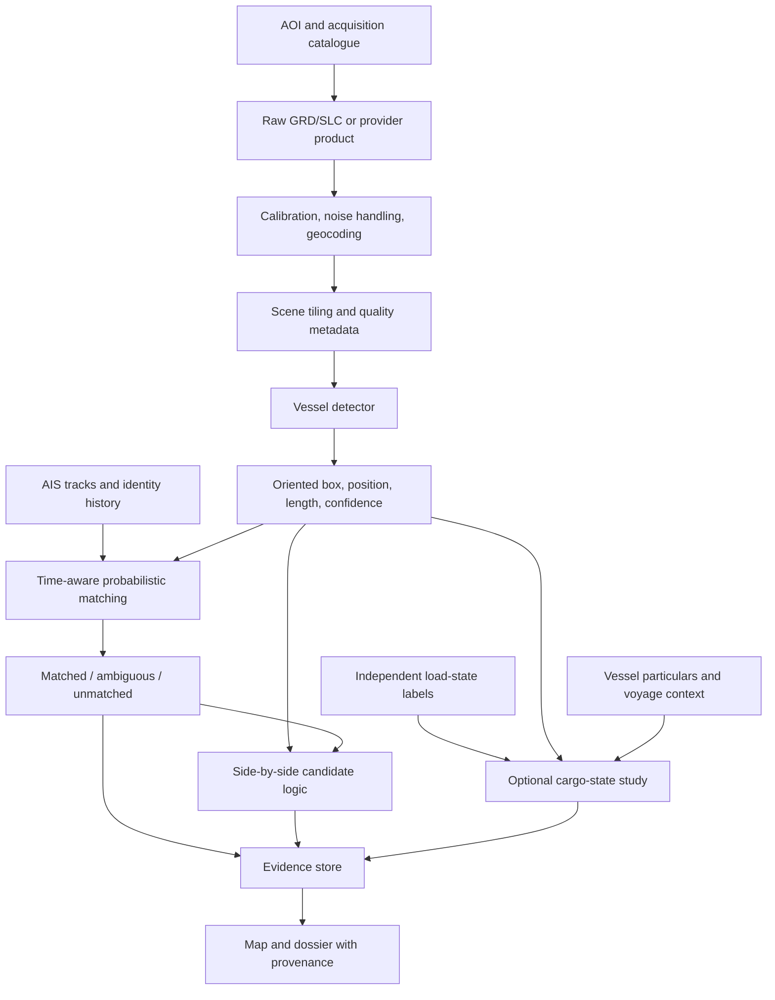

# SAR + ML Pilot Plan

*Planning document only. No SAR model or product integration is implemented in
the current hackathon build.*

## Objective

Determine, with reproducible evidence, which SAR capabilities can improve
Ghost Fleet's trader-facing hidden-supply signal:

1. physical vessel detection independent of AIS;
2. SAR-to-AIS consistency and unmatched-detection screening;
3. possible side-by-side/STS activity;
4. laden-versus-ballast estimation, only if suitable labels and imagery exist.

The pilot is successful if it produces an honest go/no-go decision for each
capability. A trained model is not itself a success criterion.

## Stage 0 — research governance and scope

### Inputs

- Choose one or two small historical areas of interest from routes already
  relevant to the sanctioned tanker cohort.
- Choose a bounded date range with known Sentinel-1 coverage.
- Record all data terms, attribution, access date, product identifiers, image
  acquisition times, and processing parameters.
- Define analyst-facing language before modelling: observation, match,
  candidate, estimate, unknown.

### Exit gate

- Actual archive coverage is adequate for the selected period.
- Data terms permit the intended experiment and publication.
- The research question remains within the approved trader-focused brief.

If any gate fails, change the area/time window or stop; do not imply global
coverage from an unsuitable sample.

## Stage 1 — no-training SAR evidence prototype

### Work

1. Query the GFW `public-global-sar-presence:latest` dataset for the selected
   area and dates.
2. Store only reproducible metadata needed for analysis; keep tokens and bulk
   downloads out of Git.
3. Separate matched and unmatched detections.
4. For matched detections, resolve GFW vessel identity and compare IMO/MMSI,
   dimensions, position, and observation time with the Ghost Fleet record.
5. Manually review a stratified sample, including near-shore, dense-traffic,
   high-wind, matched, and unmatched cases.

### Deliverables

- A dated research extract or a script that can regenerate it, subject to
  source terms.
- A map mock-up or static figure showing observations and match status.
- A review table with reasons an unmatched result may occur.

### Exit gate

Continue only if the detections add meaningful evidence beyond the existing
AIS-derived snapshot and can be explained without overclaiming identity.

## Stage 2 — reproduce maritime-object detection

### Work

1. Download the smallest xView3/SARFish sample that exercises the official
   preprocessing and evaluation path.
2. Reproduce the reference baseline before choosing a newer architecture.
3. Pin environment, data version, checksums, commands, random seeds, and model
   weights.
4. Evaluate by full scene and geography. Do not create a random chip split that
   leaks neighbouring pixels or the same vessel across sets.
5. Run failure analysis for shore clutter, fixed infrastructure, small targets,
   sea state, and closely spaced vessels.

### Metrics

- Object-level precision, recall, and F1 under the dataset's matching rule.
- Position error and vessel-length error.
- Performance by distance from shore, target length, geography, and wind bin.
- Processing time and peak memory measured on the actual pilot hardware.

### Exit gate

The baseline must be reproducible and its error modes acceptable for generating
analyst leads. No borrowed leaderboard or hardware figure may substitute for
this result.

## Stage 3 — SAR/AIS association and dark-detection review

### Work

- Propagate AIS tracks to the exact SAR acquisition time with uncertainty.
- Generate candidate matches using time, distance, course, speed, estimated
  vessel length, and type where available.
- Solve matches at scene level rather than independently selecting the nearest
  AIS point for every detection.
- Preserve probabilities and alternative matches.
- Have an analyst review high-confidence matches, ambiguous matches, and
  unmatched detections.

### Evaluation

- Precision/recall of known matches on held-out or manually reviewed scenes.
- Reliability of match probability.
- Rate of one-to-many and many-to-one ambiguities.
- Error versus AIS time gap, vessel density, and distance from shore.

### Exit gate

Expose “unmatched” only when the system can state the search window, matching
threshold, and coverage limitations. Unmatched must remain an observation, not
an attribution of intent.

## Stage 4 — side-by-side and possible STS candidates

### Work

1. Detect distinct adjacent hulls and their oriented boxes.
2. Derive geometry: separation, parallelism, relative length, duration where
   repeated imagery or AIS exists, and distance from port/anchorage.
3. Fuse GFW encounter/loitering context and SAR/AIS match status.
4. Create a human-review queue rather than an automatic legal conclusion.

### Labels

Use independently documented STS cases where possible, plus hard negatives:
anchorage queues, bunkering, pilot/tug operations, passing traffic, port berths,
and rafted vessels. Do not label every side-by-side pair as a transfer.

### Evaluation

Report event-level precision/recall, PR-AUC for the rare positive class, false
alerts per observation area or vessel-day, and time/duration error where a time
series exists. Split by vessel pair, time, and geography.

### Exit gate

The system must distinguish “two nearby objects” from a reviewed side-by-side
configuration. The output remains “possible STS activity” unless corroborating
evidence verifies a transfer.

## Stage 5 — cargo-state feasibility study

Start this stage only after obtaining both high-resolution imagery and
independent labels.

### Study cohort

- Multiple observations per tanker across clearly different load states.
- More than one tanker class and hull, with some vessels entirely held out.
- Variation in incidence angle, heading, sea state, and sensor where feasible.
- Exact temporal alignment between image and label.

### Baselines

Compare any ML model with:

1. majority class;
2. last known state;
3. vessel-specific draught threshold where trusted draught exists;
4. voyage/port-context model without imagery;
5. simple SAR-feature model before deep learning.

If imagery does not add measurable out-of-vessel value over the non-image
baselines, do not deploy an SAR cargo classifier.

### Output policy

Return calibrated probabilities for `LIKELY_LADEN`, `LIKELY_BALLAST`, or
`UNKNOWN`. Select abstention thresholds on validation data, then freeze them
before final evaluation. Display the observation time, image source, model
version, confidence, and supporting evidence.

### Exit gate

- Performance is measured on held-out vessels and at least one shifted
  condition (geography, time, or sensor).
- Probabilities are calibrated well enough for the intended display.
- Failure cases and subgroup results are documented.
- An analyst can explain why the model abstained or what evidence supported a
  non-unknown result.

## Suggested technical architecture

Keep large imagery, intermediate tiles, and trained weights in external object
storage or an artifact registry. Commit only code, small fixtures, metadata
manifests, evaluation summaries, and source/licence records.

## Risks and mitigations

| Risk | Mitigation |
|---|---|
| Sentinel-1 target is visible but freeboard is not resolvable | Separate detection from cargo-state claims; require a commercial-imagery experiment for freeboard |
| AIS used as circular “ground truth” | Reserve independent labels for final evaluation |
| Adjacent ships merge into one SAR blob | Use oriented instance detection and high-resolution imagery; return unknown when separation fails |
| Geography/sensor domain shift | Hold out regions and sensors; report subgroup performance |
| Dense ports create false dark-vessel flags | Model scene-level association and review near-shore cases separately |
| Missing acquisition at the event time | Query coverage before selecting cases; treat absence of imagery as missing data |
| Commercial rights block product use | Review tasking, archive, derived-product, redistribution, and model-training rights before purchase |
| Model confidence is mistaken for proof | Use evidence language, visible uncertainty, and an analyst review step |
| Research data bloats or leaks into Git | Keep downloads, caches, credentials, chips, and weights ignored and outside the repository |

## Reproducibility record for every experiment

Record:

- hypothesis and allowed claim;
- data provider, collection/product ID, licence, and access date;
- scene IDs, timestamps, mode, polarisation, orbit/look direction, incidence
  angle, pixel spacing, and true resolution;
- preprocessing software and parameters;
- label source, timestamp, uncertainty, and reviewer agreement;
- split construction and leakage checks;
- code revision, environment, hardware, seed, and exact command;
- metrics with confidence intervals and subgroup results;
- false-positive/false-negative examples;
- go/no-go decision and remaining uncertainty.

## Immediate next research action

Run Stage 1 only: a small historical GFW SAR matched/unmatched study in one
approved corridor. It has the best evidence-to-effort ratio, requires no model
training, and will reveal whether SAR observations materially improve the
current Ghost Fleet dossier before the project incurs imagery and labelling
costs.
